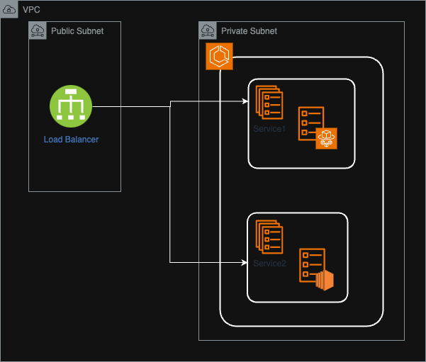

# A simple CDK + ECS + Load balancer project

This is a simple cdk project, for example

- ALB split the requests based on the path
- Service 1 runs on Fargate
- Service 2 runs on SC2

## Useful commands

* `npx cdk deploy`  deploy this stack to your default AWS account/region
* `npx cdk diff`    compare deployed stack with current state
* `npx cdk synth`   emits the synthesized CloudFormation template
